<a name="readme-top"></a>


<!--
*** I'm using markdown "reference style" links for readability.
*** Reference links are enclosed in brackets [ ] instead of parentheses ( ).
*** See the bottom of this document for the declaration of the reference variables
*** https://www.markdownguide.org/basic-syntax/#reference-style-links
-->


<!-- PROJECT LOGO -->
<br />
<div align="center">
  <a href="https://github.com/advanced-computer-lab-2023/MangoDB-Pharmacy">
    
  </a>

  <h1 align="center">MangoDB Virtual Pharmacy</h1>
  <h4 align="center">
   Your Medications, Right At Your Doorstep
  </h4>
</div>


<!-- TABLE OF CONTENTS -->
<details>
  <summary>Table of Contents</summary>
  <ol>
    <li>
      <a href="#about-the-project">About The Project</a>
      <ul>
        <li><a href="#description">Description</a></li>
        <li>
            <a href="#features">Features</a>
            <!-- <ul>
                <li><a href="#patients">Patient-Centric Features:</a></li>
                <li><a href="#doctors">Doctor-Empowering Tools:</a></li>
                <li><a href="#admins">Administrator Oversight:</a></li>
            </ul> -->
        </li> 
        <li><a href="#screenshots">Screenshots</a></li>
        <li><a href="#built-with">Built With</a></li>
      </ul>
    </li>
    <li>
      <a href="#getting-started">Getting Started</a>
      <ul>
        <li><a href="#prerequisites">Prerequisites</a></li>
        <li><a href="#installation">Installation</a></li>
        <li><a href="#usage">Usage</a></li>
      </ul>
    </li>
    <li><a href="#running-tests">Running Tests</li>
    <li><a href="#code-specifcations">Code Specifcations</a></li>
    <li><a href="#generate-api-documentation">Generate API Documentation</a></li>
    <li><a href="#contributing">Contributing</a></li>
    <li><a href="#credits">Credits</a></li>
    <li><a href="#license">License</a></li>
  </ol>
</details>


<!-- ABOUT THE PROJECT -->
## About The Project

### Description 🧾

<!-- MangoDB Virtual Clinic is a comprehensive virtual healthcare platform that bridges the gap between patients, doctors, and administrators. Our platform is built on the principles of accessibility, efficiency, and security, ensuring that every interaction within the healthcare ecosystem is seamless and beneficial. The platform offers a user-friendly interface for patients to manage their health records, schedule appointments, and avail of exclusive discounts on medicines through subscription packages. Doctors, on the other hand, have tools to efficiently manage prescriptions, appointments, and patient interactions. -->

MangoDB Virtual Pharmacy is a fully optimized and digitalized platform that provide a user-friendly interface for patients, pharmacists, and administrators to use the pharmacy. In the development of the platform we had a vision of keeping the platform as user-friendly and efficient as possible while maintaining high levels of accessibility. We were also able to acheive a high optimization level by keeping the Virtual Pharmacy features that are of similar nature together to enhance the user experience and efficiency in navigating through the pages. Through our platform, patients are able to view and filter medications, order medications to their saved or new address, and chat with a pharmacist as well as many other features. While pharmacists can update the prices and quantities of medicines, as well as start a chat with a doctor amongst other features, all to be discussed in further details.
<p align="right">(<a href="#readme-top">back to top</a>)</p>

### Features ✨
<details>
<summary><strong>Patient-Centric Features:</strong></summary>

1. *User Registration and Authentication:*
    - Securely register as a patient with authentication mechanisms to protect user information.
    - Easily change your passowrd anytime.

2. *Pharmacist Interaction:*
    - Start a secured live chat with pharmacists for remote consultations/enquiries about medications.

3. *Viewing Medications:*
    - View all medications.
    - Search for a specific medication through typing a name or filering by use. 
    - View alternate medications to the medicine you have chosen in case it is out of stock.

4. *Ordering Medications:*
    - Add a medicine that does not require a prescription to cart.
    - Add a medicine that does require prescription if the prescription exists to maintain safe use of the medication.
    - View cart details.
    - View total due amount and pick payment method.
    - Pick address from existing address or add new address.
    - Complete payment and place order.

5. *Order Management:*
   - View all orders' details.
   - Cancel order.

6. *Wallet for Hassle-Free Payments:*
   - Utilize a wallet for easy and secure payments within the platform.
   - View all transactions made as well as updated balance.


<!-- <p align="right">(<a href="#readme-top">back to top</a>)</p> -->
</details>

<details>
<summary><strong>Pharmacist-Empowering Tools:</strong></summary>

1. *User Registration and Authentication:*
    - Securely register as a pharmacist with authentication mechanisms to protect user information.
    - Easily change your passowrd anytime.

2. *Streamlined Medicine Management:*
   - View all medicines.
   - Arcbive and unarchi ve medicines.
   - Add new medicine.
   - Update the details and prices of medicines.
   

3. *Patient Interaction Hub:*
   - Engage in real-time chat conversations with patients.


4. *Doctor Interaction:*
    - Start a secured live chat with doctors for remote consultations and to infor the doctor of the availability of a specific medicine for future prescriptions.

5. *Sales Report:*
    - View sales of all medicines and total.
    - Filter sales by medicine or month to expedite the gathering of data for a specific use.

6. *Notifications System:*
    - Be promptly informed about a medication running out of stock

7. *Wallet for Receiving Salary:*
    - Receive the monthly salary directly on the wallet.

<!-- <p align="right">(<a href="#readme-top">back to top</a>)</p> -->
</details>

<details>
<summary><strong>Administrator Oversight:</strong></summary>

1. *Centralized System Control:*
    - Administrators have a powerful interface to oversee and manage all aspects of the MangoDB Virtual Pharmacy.
    - Ensure compliance, security, and seamless operation of the entire healthcare platform.
    - Accept/Reject pharmacists into the system.

2. *Analytics and Reporting:*
    - Leverage comprehensive analytics to gain insights into user engagement, sales trends, and overall system performance.
    - Generate detailed reports to inform strategic decisions and enhance the overall user experience.

</details>

<p align="right">(<a href="#readme-top">back to top</a>)</p>


### Screenshots 📸


<details>
<summary>Register Pharmacist</summary>
  
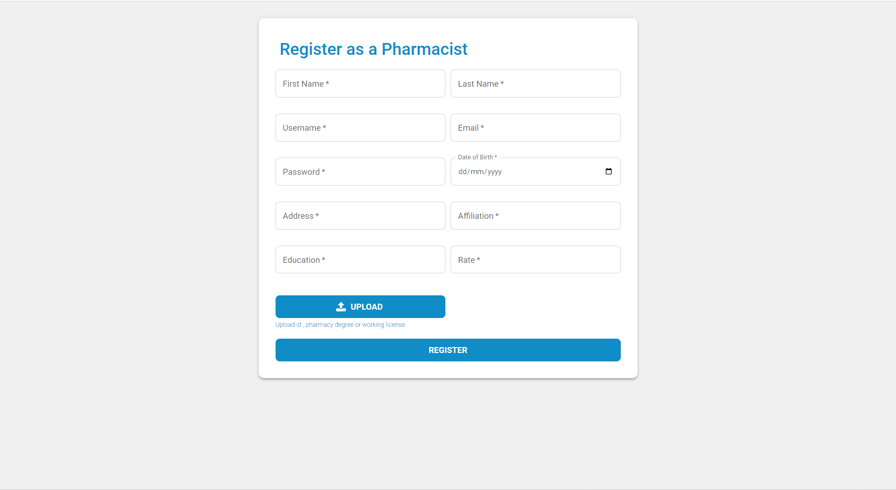
    
</details>

<details>
<summary>Login User</summary>
  
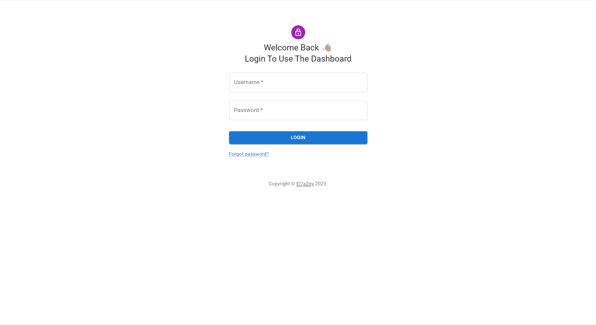
    
</details>

<details>
<summary>Pharmacist's Wallet</summary>
  
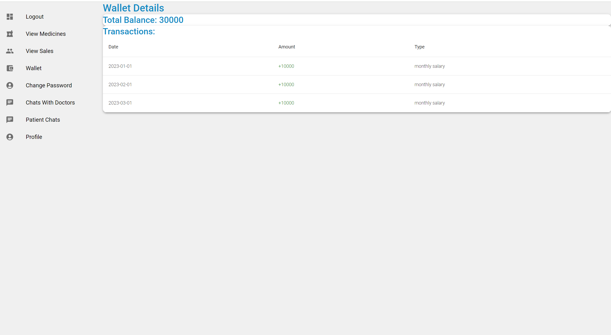
    
</details>

<details>
<summary>Patient Dashboard</summary>
  
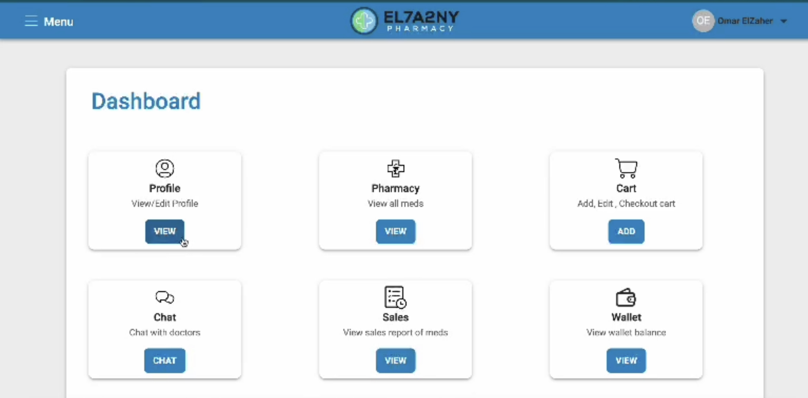
    
</details>

<details>
<summary>Patient Wallet</summary>
  
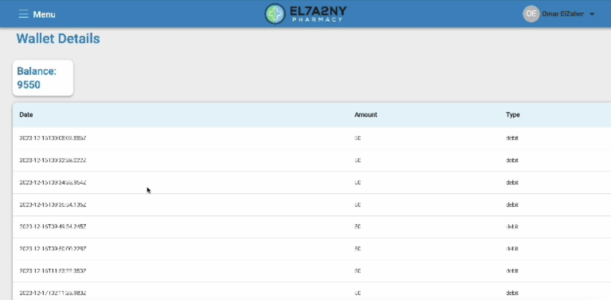
    
</details>


<p align="right">(<a href="#readme-top">back to top</a>)</p>

### Built With 🛠️

*Tech/Framework used:*

<!-- * [![Next][Next.js]][Next-url] -->
* [![Node][Node.js]][Node-url]
* [![React][React.js]][React-url]
* [![Express][Express.js]][Express-url]
* [![Mui][Material-ui]][Material-ui-url]
* [![Mongo][MongoDB]][MongoDB-url]
* [![JWT][Jsonwebtokens]][Jsonwebtokens-url]
* [![Stripe][Stripe]][Stripe-url]
* [![Figma][Figma]][Figma-url]
* [![VScode][VScode]][VScode-url]
* [![Postman][Postman]][Postman-url]
* [![Github][Github]][Github-url]
* [![Git][Git]][Git-url]
*  


<p align="right">(<a href="#readme-top">back to top</a>)</p>


### Built Status
* The Unit tests need implementation
* The project is currently in development
* Some input fields are case sensitive
* UI could be improved
* Cookies could be implemented for smoother operations
* File size is too large due to redundant code and could be more organised
* The use of comments could be improved to aid in future maintenance
* There may be bugs that haven't been found yet


<!-- GETTING STARTED -->
## Getting Started

To set up MangoDB Virtual Pharmacy locally and start exploring its features, follow these simple steps:

### Prerequisites

Before you begin, make sure you have the following installed on your machine:

- [Node.js](https://nodejs.org/) - Ensure Node.js is installed to run the application.
- [MongoDB](https://www.mongodb.com/try/download/community) - Set up a MongoDB database to store application data.
- [VScode](https://code.visualstudio.com) - Install any IDE to run the project on.
- [Stripe](https://stripe.com) - Head to Stripe and get your Stipe private key.

### Installation 📥

1. **Clone the repo**
   ```sh
   git clone https://github.com/advanced-computer-lab-2023/MangoDB-Pharmacy.git
   ```
2. **Navigate to the project directory:**
   ```sh
   cd MangoDB-Pharmacy
   ```
3. **Install NPM packages**
   ```sh
   npm install
   ```
4. **Navigate to the frontend folder:**
   ```sh
   cd reactfile
   ```
5. **Install NPM packages**
   ```sh
   npm install
   ```
    **Open a New Terminal:**

6. **Navigate to the frontend folder:**
   ```sh
   cd backend
   ```
7. **Install NPM packages**
   ```sh
   npm install
   ```
8. **Create a .env File:**

   In the root directory of MangoDB Virtual Pharmacy, create a `.env` file with the following content:

   ```js
    # MongoDB Connection URI
    MONGO_URI="your_mongodb_url"

    # JSON Web Token Secret
    JWT_SECRET="your_secure_passphrase"

    # Stripe Private Key
    STRIPE_PRIVATE_KEY="your_stripe_private_key" 
   ```
   Make sure to replace the placeholder values with your actual MongoDB connection URL, a secure passphrase for JWT, and your Stripe private key.

   **Note**: Keep your `.env file secure and never expose it to the public. It contains sensitive information required for the proper functioning of MangoDB Virtual Pharmacy.

9. **Run the Backend**

   ```sh
   npm run server
   ```

**Now open the terminal for the frontend**

10. **Run the Application:**

     ```sh
     npm start
     ```
    This command will launch MangoDB Virtual Pharmacy with the specified configurations from your .env file. Access the application in your web browser at http://localhost:3000.

    **Note**: Ensure that MongoDB is running and accessible before starting the application.


<p align="right">(<a href="#readme-top">back to top</a>)</p>


<!-- USAGE EXAMPLES -->
### Usage

Experience the MangoDB Virtual Pharmacy by following these simple steps:

1. **Open your Web Browser:**
   - Launch your preferred web browser.

2. **Visit MangoDB Virtual Pharmacy:**
   - Go to [http://localhost:3000](http://localhost:3000) to access the MangoDB Virtual Pharmacy platform.

3. **Register Your Account:**
   - Sign up as either a patient or a pharmacist to unlock the platform's rich features.

4. **Explore the Patient Dashboard:**
   - Dive into the intuitive patient dashboard to seamlessly manage your health journey.

5. **Order Medications:**
   - Use the Medicines page to view all medicines then pick the desired medicine and att it your cart then head over to the cart page and complete your order.

6. **Manage Orders:**
   - Keep track of your orders, and easily cancel them when needed.

7. **Engage with Pharmacists**
    - Connect directly with pharmacists who can provide guidance on medication use and treatment plans as well as the availability of specific medications.

8. **For Pharmacists: Efficiently Manage Medicines:**
   - Access tools to add/update/archive medicines with the click of a button.

9. **For Pharmacists: Easily View Sales Report:**
   - View and filter sales report with ease, providing accurate information.

10. **For Pharmacists: Engage with Patients and Doctors:**
    - View patient interactions and communicate effectively to enhance overall healthcare outcomes as well as initiate communication with doctors to enquire or inform them of a specific medicine.

**Note**: To gain full experience try first filling the database with doctors and patients so you can see all the features.

<p align="right">(<a href="#mangodb-virtual-pharmacy">back to top</a>)</p>


## Running Tests 🧪

The testing is done using [Postman](https://www.postman.com)
**Note:**For testing any GET, PUT, POST, PATCH

<details>
<summary><strong>Patient Login test:</strong></summary>

You should register first a doctor or a patient to test the Login
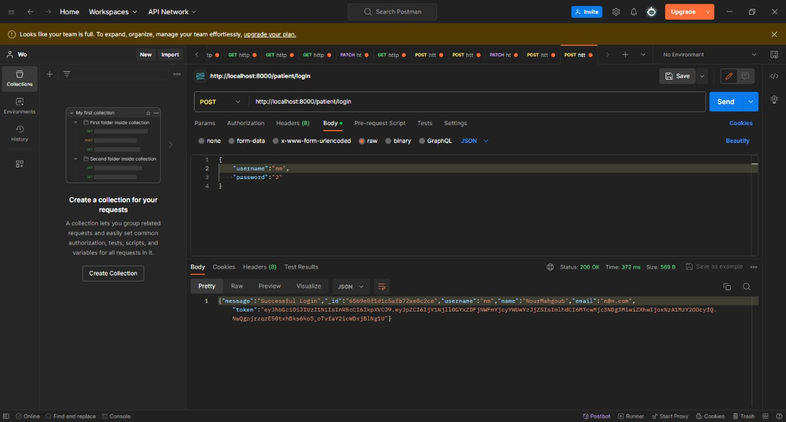

</details>

<details>
<summary><strong>View Medicines test:</strong></summary>

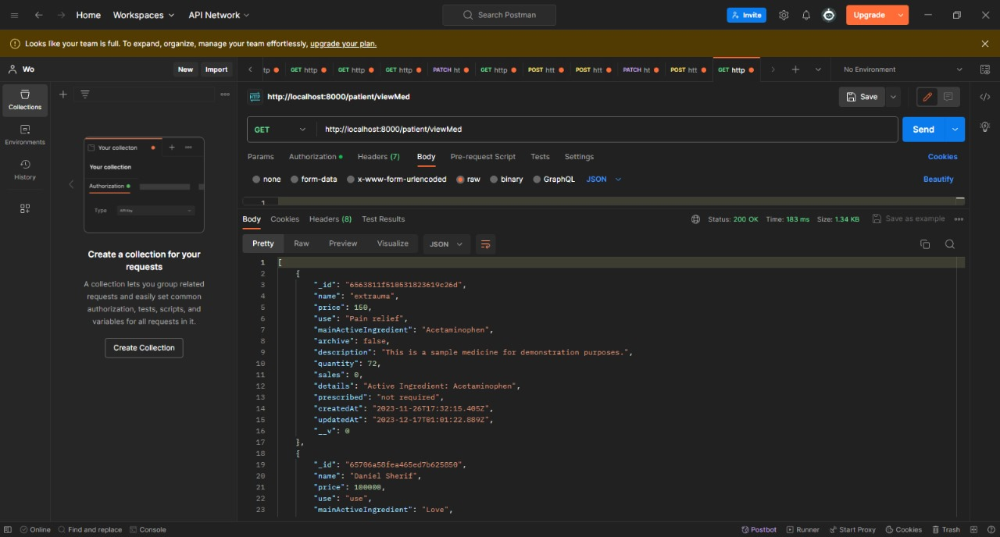

**Note**: You may get an empty array in case there are no Medications.
</details>

<details>
<summary><strong>Add Medicine to Cart:</strong></summary>
Enter the token you got from the login in bearer auth in postman

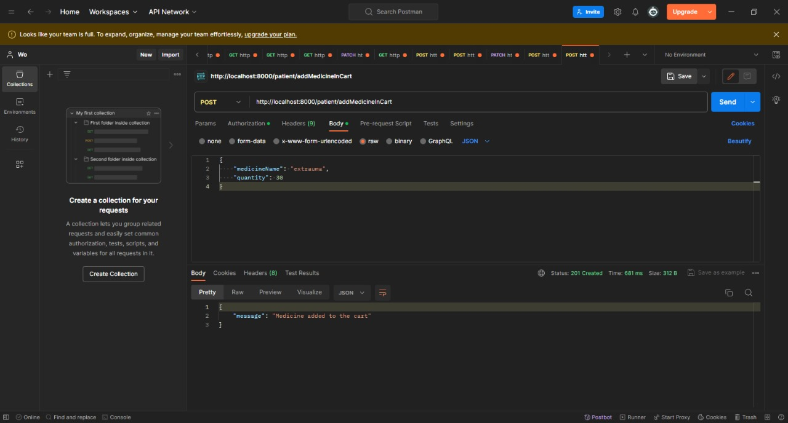

</details>


<details>
<summary><strong>Edit Medicine Price:</strong></summary>

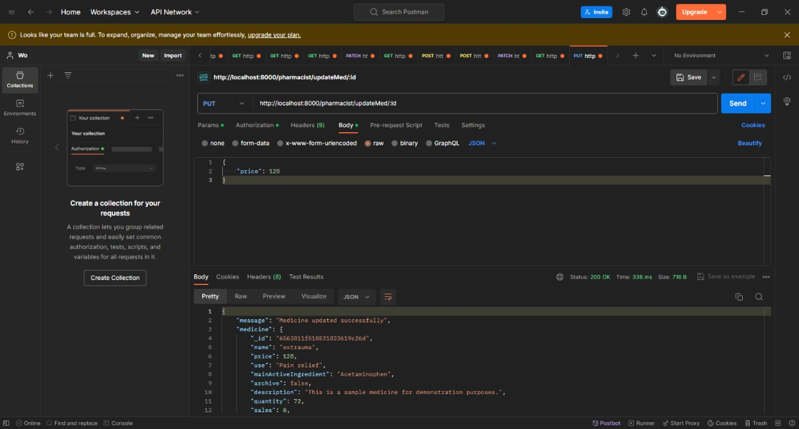

</details>

<details>
<summary><strong>Add New Medicine:</strong></summary>

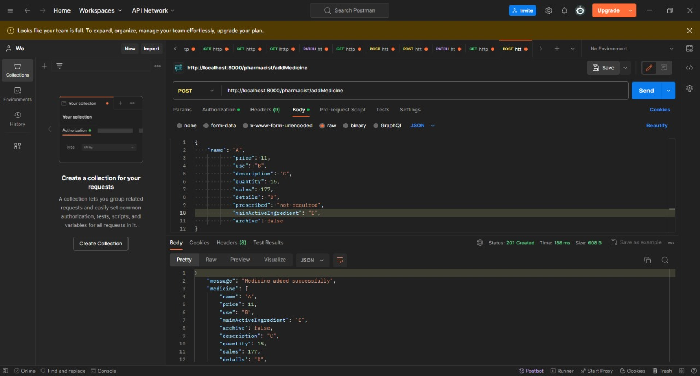

</details>

<details>
<summary><strong>Accept Pharmacist:</strong></summary>

You should register first a Pharmacist
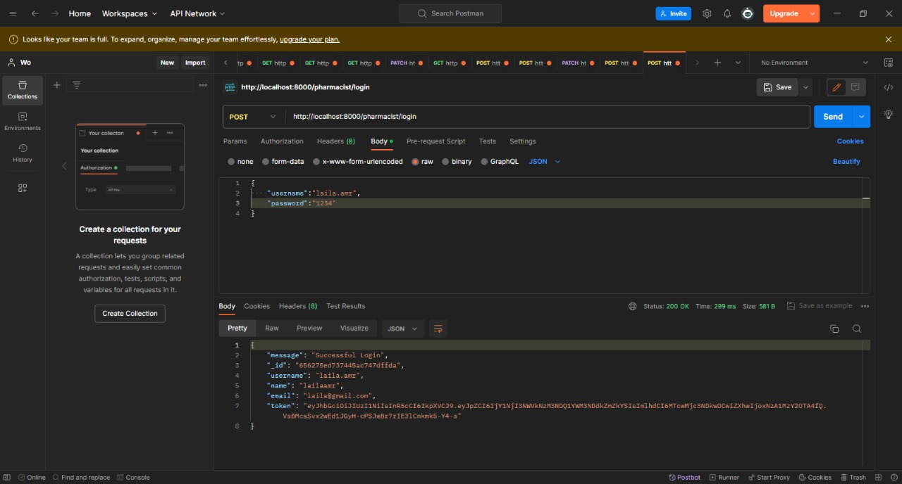

</details>


<!-- ROADMAP -->
## Code Specifcations ⚙️

<details>
<summary><strong>Structure:</strong></summary>

```bash
.
├── README.md
├── backend
│   ├── config
│   │   └── db.js
│   ├── controllers
│   │   ├── adminController.js
│   │   ├── clinicController.js
│   │   ├── guestController.js
│   │   ├── patientController.js
│   │   └── pharmacistController.js
│   ├── middleware
│   │   ├── adminMiddleware.js
│   │   ├── authMiddleware.js
│   │   ├── errorMiddleware.js
│   │   ├── patientMiddleware.js
│   │   ├── pharmacistMiddleware.js
│   │   ├── stripeMiddleware.js
│   │   └── upload.js
│   ├── models
│   │   ├── adminModel.js
│   │   ├── chatModel.js
│   │   ├── clinicModel.js
│   │   ├── doctorModel.js
│   │   ├── guestModel.js
│   │   ├── medicineModel.js
│   │   ├── messageModel.js
│   │   ├── orderModel.js
│   │   ├── packagesModel.js
│   │   ├── patientModel.js
│   │   ├── pharmacistModel.js
│   │   ├── prescriptionModel.js
│   │   ├── userModel.js
│   │   └── walletModel.js
│   ├── public
│   │   └── styles.css
│   ├── routes
│   │   ├── adminRoutes.js
│   │   ├── clinicRoutes.js
│   │   ├── guestRoutes.js
│   │   ├── patientRoutes.js
│   │   └── pharmacistRoutes.js
│   ├── server.js
│   ├── tests.txt
│   └── uploads
│       ├── 1699559562737-.png
│       ├── 1699559643151-.png
│       ├── 1699714841291-.png
│       ├── 1699714885283-.png
│       ├── 1699955085491-.jpg
│       ├── 1699955227138-.pdf
│       ├── 1699955227149-.png
│       ├── 1699955305883-.jpg
│       ├── 1699955305883-.pdf
│       ├── 1699955305887-.png
│       ├── 1699966831519-.png
│       ├── 1699966909299-.png
│       ├── 1699967100690-.jpg
│       ├── 1699967234057-.jpg
│       ├── 1699967260458-.jpg
│       ├── 1699967305826-.jpg
│       ├── 1699984333316-.jpg
│       ├── 1699984949911-.jpg
│       ├── 1699984949918-.jpg
│       ├── 1699988798231-.jpg
│       ├── 1699988857003-.jpg
│       ├── 1699989160603-.jpg
│       ├── 1699989160617-.jpg
│       ├── 1699989780165-.jpg
│       ├── 1699998187907-.jpg
│       ├── 1699998221556-.jpg
│       ├── 1700039669825-.pdf
│       ├── 1700040832347-.pdf
│       ├── 1700040910215-.png
│       ├── 1700605315783-.png
│       ├── 1700950623483-.pdf
│       ├── 1700951068644-.pdf
│       ├── 1700951303205-.pdf
│       ├── 1700951316448-.pdf
│       ├── 1700951532643-.pdf
│       ├── 1700951735873-.pdf
│       ├── 1700951824616-.pdf
│       ├── 1700951876155-.pdf
│       ├── 1700952291229-.pdf
│       ├── 1700952366524-.pdf
│       ├── 1700952477864-.pdf
│       ├── 1700953082913-.pdf
│       ├── 1701647324138-.png
│       ├── 1701815234869-.png
│       ├── 1701818224252-.pdf
│       ├── 1701866072465-.png
│       └── 1701866082081-.png
├── package-lock.json
├── package.json
└── reactfile
    ├── README.md
    ├── package-lock.json
    ├── package.json
    ├── public
    │   ├── favicon.ico
    │   ├── icons
    │   │   ├── accept.svg
    │   │   ├── add.svg
    │   │   ├── addMember.svg
    │   │   ├── address.svg
    │   │   ├── appointment.svg
    │   │   ├── approvedDocument.svg
    │   │   ├── call.svg
    │   │   ├── cart.svg
    │   │   ├── certificate.svg
    │   │   ├── chart.svg
    │   │   ├── chat.svg
    │   │   ├── clinic.svg
    │   │   ├── clinicLogo.svg
    │   │   ├── clinicLogo2.svg
    │   │   ├── clinicalDocument.svg
    │   │   ├── clinicalRecord.svg
    │   │   ├── creditCard.svg
    │   │   ├── dashboard.svg
    │   │   ├── date.svg
    │   │   ├── defaultLogo.svg
    │   │   ├── deniedDocument.svg
    │   │   ├── editDocument.svg
    │   │   ├── family.svg
    │   │   ├── familyFolder.svg
    │   │   ├── filter.svg
    │   │   ├── finance.svg
    │   │   ├── healthPackage.svg
    │   │   ├── index.js
    │   │   ├── info.svg
    │   │   ├── login.svg
    │   │   ├── logoEmblem.svg
    │   │   ├── logout.svg
    │   │   ├── meds.svg
    │   │   ├── medsV2.svg
    │   │   ├── menu.svg
    │   │   ├── mobile.svg
    │   │   ├── notes.svg
    │   │   ├── notifications.svg
    │   │   ├── password.svg
    │   │   ├── patient.svg
    │   │   ├── person.svg
    │   │   ├── pharmacist.svg
    │   │   ├── pharmacy.svg
    │   │   ├── pharmacyLogo.svg
    │   │   ├── pharmacyLogo2.svg
    │   │   ├── pp1.png
    │   │   ├── preferences.svg
    │   │   ├── prescription.svg
    │   │   ├── profile.svg
    │   │   ├── reject.svg
    │   │   ├── remove.svg
    │   │   ├── search.svg
    │   │   ├── secure.svg
    │   │   ├── settings.svg
    │   │   ├── tabIcon.png
    │   │   ├── ticket.svg
    │   │   ├── upload.svg
    │   │   ├── wallet.svg
    │   │   └── warning.svg
    │   ├── images
    │   │   └── med.png
    │   ├── index.html
    │   ├── manifest.json
    │   └── robots.txt
    └── src
        ├── App.css
        ├── App.js
        ├── components
        │   ├── AdminHeader.js
        │   ├── Dashboard.js
        │   ├── DashboardAdmin.js
        │   ├── DashboardPharma.js
        │   ├── ForgotPasswordAdmin.jsx
        │   ├── ForgotPasswordUser.jsx
        │   ├── ListItems.js
        │   ├── ListItemsAdmin.js
        │   ├── ListItemsPharma.js
        │   ├── LoginAdmin.jsx
        │   ├── LoginUser.jsx
        │   ├── RequestedPharmacists.js
        │   ├── RequestedPharmacists.jsx
        │   ├── Spinner.jsx
        │   └── pharmacistChatDoctor.js
        ├── index.css
        ├── index.js
        ├── pages
        │   ├── ForgotPasswordAdminPage.jsx
        │   ├── ForgotPasswordUserPage.jsx
        │   ├── Home.js
        │   ├── LoginAdminPage.jsx
        │   ├── LoginUserPage.jsx
        │   ├── Pharmacists.js
        │   ├── RequestedPharmacistsPage.jsx
        │   ├── addMed.js
        │   ├── archivedMedicines.js
        │   ├── cart.js
        │   ├── changePasswordAdmin.js
        │   ├── changePasswordPatient.js
        │   ├── changePasswordPharmacist.js
        │   ├── chat.js
        │   ├── chat2.js
        │   ├── chatPharmacistPatient.js
        │   ├── checkout.js
        │   ├── medicine.js
        │   ├── medicineAdmin.js
        │   ├── medicinePharma.js
        │   ├── newChat.js
        │   ├── newChatPharmacist.js
        │   ├── order.js
        │   ├── orderDetails.js
        │   ├── patientDetails.js
        │   ├── patientReg.js
        │   ├── pharmaReg.js
        │   ├── pharmacistChatDoctor.js
        │   ├── pharmacistDetails.js
        │   ├── requestedPharma.js
        │   ├── sales.js
        │   ├── salesAdmin.js
        │   ├── temp.js
        │   ├── viewMeds.js
        │   ├── viewMedsAdmin.js
        │   ├── viewMedsPharma.js
        │   ├── viewPatientChats.js
        │   ├── viewPatients.js
        │   ├── viewPharmacists.js
        │   ├── wallet.js
        │   └── walletPharma.js
        ├── services
        │   └── api.js
        ├── styles
        ├── theme.js
        └── useFetch.js
```

</details>

<details>
<summary><strong>Styles 🪄: </strong></summary>
<ul>
      <li><strong>Indentation:</strong> We use spaces for indentation, with a tab width of 2 spaces.</li>
      <li>
        <strong>
            Naming Conventions:
        </strong> 
            <ul>
                <li>Follow camelCase for variable, function names, and routes.</li>
                <li>Use PascalCase for frontend folders and camelcase for backend folders.</li>
            </ul>
        </li>
      <li><strong>Comments:</strong> Add meaningful comments to explain complex sections of code.</li>
      <li><strong>Files Managment:</strong> Files should be placed at the right place.
    </ul>
</details>


## Code Examples:


<details>
<summary><strong>Add a Medicine To Cart</strong></summary>


```javascript
const addMedicineToCart = async (req, res) => {
    const { medicineName, quantity } = req.body;
    const patientId = req.user._id;
    try {
        const patient = await Patient.findById(patientId);

        if (!patient) {
            return res.status(404).json({ error: "Patient not found" });
        }

        const cartItem = patient.cart.find(
            (item) => item.medicineName === medicineName
        );
        const medicine = await Medicine.findOne({ name: medicineName });

        if (!medicine) {
            return res.status(404).json({ error: "Medicine not found" });
        }

        if (medicine.prescribed === "required") {
            // Check if the patient has a prescription for the medicine
            const prescription = await Prescription.findOne({
                patientId,
                'medications.medicationName': medicineName,
              });
              
              if (!prescription) {
                return res.status(400).json({
                  error: `This medicine requires a prescription.`,
                });
              }
          }
        if (cartItem) {
            const totalQuantity = cartItem.quantity + quantity;
            if (totalQuantity > medicine.quantity) {
                return res.status(400).json({
                    error: `Quantity not available. Available quantity for ${medicineName}: ${
                        medicine.quantity - cartItem.quantity
                    }`,
                });
            }
            const totalPrice = totalQuantity * medicine.price;
            cartItem.quantity = totalQuantity;
            cartItem.price = totalPrice;
        } else {
            if (quantity > medicine.quantity) {
                return res.status(400).json({
                    error: `Quantity not available. Available quantity for ${medicineName}: ${medicine.quantity}`,
                });
            }
            const totalPrice = quantity * medicine.price;
            patient.cart.push({
                medicineName: medicine.name,
                quantity: quantity,
                price: totalPrice,
            });
        }
        await patient.save();
        return res.status(201).json({ message: "Medicine added to the cart" });
    } catch (error) {
        console.error(error);
        return res.status(500).json({ error: "Internal server error" });
    }
};


```
</details>

<details>
<summary><strong>Add Address</strong></summary>


```javascript
const addAddress = async (req, res) => {
	const { address } = req.body;
	const patientId = req.user._id;

	try {
		const patient = await Patient.findById(patientId);

		if (!patient) {
			return res.status(404).json({ error: "Patient not found" });
		}

		patient.addresses.push(address);

		await patient.save();

		return res.status(201).json({ message: "Address added successfully" });
	} catch (error) {
		console.error(error);
		return res.status(500).json({ error: "Internal server error" });
	}
};


```
</details>

<details>
<summary><strong>Add Medicine</strong></summary>


```javascript
const addMedicine = (req, res) => {
    try {
        const {
            name,
            price,
            use,
            description,
            quantity,
            sales,
            details,
            prescribed,
            mainActiveIngredient,
            archive,
        } = req.body;

        // Check if req.file is defined before using it
        const medicine = new Medicine({
            name,
            price,
            use,
            description,
            quantity,
            sales,
            details,
            prescribed,
            mainActiveIngredient,
            archive,

        });

        if (req.file) {
            // If a file is uploaded, set the picture path
            medicine.picture = req.file.path;
        }

        medicine
            .save()
            .then((result) => {
                console.log("NEW MEDICINE ADDED:", result);
                res.status(201).json({
                    message: "Medicine added successfully",
                    medicine: result,
                });
            })
            .catch((err) => {
                console.log("Error saving medicine:", err);
                res.status(500).json({
                    error: "Internal server error",
                });
            });
    } catch (error) {
        console.error("Error adding medicine:", error);
        res.status(500).json({
            error: "Internal server error",
        });
    }
};


```
</details>

<details>
<summary><strong>Get Sales by Month</strong></summary>


```javascript
const getSalesByMonth = asyncHandler(async (req, res) => {
    try {
      const { month } = req.body; // Assuming the month is passed in the request body
  
      if (!month) {
        res.status(400).json({ error: "Month parameter is required" });
        return;
      }
  
      // Convert the month to a format that MongoDB can query
      const startDate = new Date(`${month}-01T00:00:00.000Z`);
      const endDate = new Date(
        new Date(startDate).setMonth(startDate.getMonth() + 1)
      );
  
      const sales = await Order.find({
        status: "preparing", // Assuming sales are only considered if the status is "preparing"
        dateOfDelivery: {
          $gte: startDate,
          $lt: endDate,
        },
      });
  
      // Extract relevant information for the table
      const formattedSales = sales.map((order) => ({
        orderId: order._id,
        dateOfDelivery: order.dateOfDelivery,
        totalPrice: order.totalPrice,
        orderDetails: order.orderdetails.map((item) => ({
          medicineName: item.medicineName,
          quantity: item.quantity,
        })),
      }));
  
      res.status(200).json({
        message: `Sales for ${month}`,
        sales: formattedSales,
      });
    } catch (error) {
      console.error(error);
      res.status(500).json({ error: "Internal server error" });
    }
  });


```
</details>

<details>
<summary><strong>Get the Pending Pharmacists</strong></summary>


```javascript
const getPendingPharma = asyncHandler(async (req, res) => {
	try {
		const pendingPharmacists = await Pharmacist.find({ status: "pending" });

		if (pendingPharmacists.length === 0) {
			return res
				.status(404)
				.json({ error: "No pharmacists with pending status found" });
		}
		console.log(pendingPharmacists);

		return res.json(pendingPharmacists);
	} catch (error) {
		console.error(error);
		return res
			.status(500)
			.json({ error: "An error occurred while retrieving pharmacists" });
	}
});


```
</details>


<details>
<summary><strong>Chat Frontend Design</strong></summary>


```javascript
return (
    <PatientHeader>

    <Grid container>
    
      {/* Main Content */}
      <Grid item xs={12} sm={9} md={10} lg={10} xl={10 }style={{ paddingLeft: "20rem" }}>
        {/* App Bar with Name */}
        <AppBar position="static" style={{ maxWidth: "840px" }}>
          <Toolbar>
            <Typography variant="h6">{pharmacist.firstName} {pharmacist.lastName}</Typography>
          </Toolbar>
        </AppBar>

        {/* Display Messages */}
        <Paper id="messages-container" elevation={3} style={{ padding: "1rem", height: "60vh", overflowY: "auto", width: "100%", maxWidth: "800px" }}>
          {messages.map((message) => (
            <div key={message._id} style={{ display: "flex", flexDirection: "column", alignItems: message.senderRole === 'patient' ? 'flex-end' : 'flex-start' }}>
              <div style={message.senderRole === 'patient' ? styles.youMessage : styles.pharmacistMessage}>
                <p>{message.messageText}</p>

                <p style={{ fontSize: "small", color: "rgba(0, 0, 0, 0.6)" }}>
      {new Date(message.timeDate).toLocaleTimeString("en-US", {
        year: "numeric",
        month: "numeric",
        day: "numeric",
        hour: "numeric",
        minute: "numeric",
      })}
    </p>
              </div>
            </div>
          ))}
        </Paper>

        {/* Message Input and Send Button */}
        <Paper elevation={3} style={{ padding: "1rem", marginTop: "1rem", maxWidth: "800px" }}>
          <Grid container spacing={2}>
            <Grid item xs={9}>
              <TextField
                fullWidth
                variant="outlined"
                label="Type your message"
                value={message}
                onChange={(e) => setMessage(e.target.value)}
              />
            </Grid>
            <Grid item xs={3}>
              <Button
                variant="contained"
                color="primary"
                onClick={handleSend}
                fullWidth
              >
                Send
              </Button>
            </Grid>
          </Grid>
        </Paper>
      </Grid>
    </Grid>
    </PatientHeader>

  );

  


```
</details>


<details>
<summary><strong>Checkout Frontend Design</strong></summary>


```javascript

 return (
 <PatientHeader>
  <Grid>
      <Grid
        item
        xs={12}
        sm={9}
        md={10}
        lg={10}
        xl={10}
        style={{ paddingLeft: '17rem' }}
      >
        <Typography variant="h4" gutterBottom>
          Checkout
        </Typography>

        {cartItems.length > 0 && (
          <div>
            <Typography variant="h6">Cart Items:</Typography>
            {cartItems.map((item) => (
              <Paper
                key={item._id}
                style={{ padding: '1rem', marginBottom: '1rem' }}
              >
                <Typography variant="h6">{item.name}</Typography>
                {item.picture && (
                  
                )}
                <Typography>Quantity: {item.quantity}</Typography>
                <Typography variant="subtitle1">
                  Price (Per Item): ${(item.price / item.quantity).toFixed(2)}
                </Typography>
                <Typography variant="subtitle1">
                  Total Price: ${(item.price).toFixed(2)}
                </Typography>
              </Paper>
            ))}
          </div>
        )}

        {cartItems.length > 0 && (
          <Typography variant="h6" style={{ marginTop: '1rem' }}>
            Total Price: ${calculateTotalPrice().toFixed(2)}
          </Typography>
        )}

        <FormControl fullWidth style={{ marginBottom: '1rem' }}>
          <InputLabel id="address-select-label">Choose an Address</InputLabel>
          <Select
            labelId="address-select-label"
            id="address-select"
            value={selectedAddress}
            onChange={handleAddressSelect}
          >
            <MenuItem value="" disabled>
              Choose an Address
            </MenuItem>
            {addresses.map((address, index) => (
              <MenuItem key={index} value={address}>
                {address}
              </MenuItem>
            ))}
          </Select>
        </FormControl>
        {!showAddAddress && (
          <Button
            variant="contained"
            color="primary"
            onClick={() => setShowAddAddress(true)}
            style={{ marginBottom: '1rem' }}
          >
            Add Address
          </Button>
        )}

        {showAddAddress && (
          <div style={{ display: 'flex', alignItems: 'center', marginBottom: '2rem' }}>
            <TextField
              label="New Address"
              variant="outlined"
              value={newAddress}
              onChange={(e) => setNewAddress(e.target.value)}
              style={{ marginRight: '1rem', flex: '1' }}
            />
            <Button variant="contained" color="primary" onClick={handleAddAddress}>
              Add Address
            </Button>
          </div>
        )}

        {selectedAddress && (
          <Typography variant="body1" style={{ marginTop: '1rem' }}>
            You chose: {selectedAddress}
          </Typography>
        )}

        {error && (
          <div style={{ color: 'red', marginTop: '1rem' }}>{error}</div>
        )}
        <FormControl fullWidth style={{ marginBottom: '1rem' }}>
          <InputLabel id="payment-method-label">Choose Payment Method</InputLabel>
          <Select
            labelId="payment-method-label"
            id="payment-method"
            value={paymentMethod}
            onChange={handlePaymentMethodSelect}
          >
            <MenuItem value="" disabled>
              Choose Payment Method
            </MenuItem>
            <MenuItem value="cash-on-delivery">Cash on Delivery</MenuItem>
            <MenuItem value="wallet">Wallet</MenuItem>
            <MenuItem value="visa-mastercard">Visa/Mastercard</MenuItem>
          </Select>
        </FormControl>
        {error && (
          <div style={{ color: 'red', marginTop: '1rem' }}>{error}</div>
        )}
        {/* {errorMessage && (
          <div style={{ color: 'red', marginTop: '1rem' }}>{errorMessage}</div>
        )} */}


        <Button
        variant="contained"
        color="primary"
        onClick={handlePlaceOrder}
        style={{ marginTop: '1rem' }}
      >
        Place an Order
      </Button>
      {(showSuccessMessage && (
        <Typography variant="body1" style={{ color: 'green', marginTop: '1rem' }}>
          Order placed successfully!
        </Typography>
      ) ) || (errorMessage &&  <Typography variant="body1" style={{ color: 'green', marginTop: '1rem' }}>
 Insufficient funds in the wallet. Please choose a different payment method or add funds to your wallet.   
  </Typography>) }
      </Grid>
    </Grid>
    </PatientHeader>
  );


```
</details>

<details>
<summary><strong>Cancel Order</strong></summary>


```javascript
const cancelOrder = async (req, res) => {
	const orderId = req.params.id;
	try {
		const order = await Order.findById(orderId);
console.log (order);
		const patient = await Wallet.findOne({ user :order.patientId  })
		console.log (patient);

		if (!order) {
			return res.status(404).json({ error: "Order not found" });
		}

		if (order.status !== "preparing") {
			return res.status(200).json({ error: "Order cannot be canceled" });
		}

		order.status = "cancelled";
		
		if (order.paymentMethod == "wallet"){
         patient.balance+= order.totalPrice;
		 patient.transactions.push({
			type: "order canceled",
			amount: + order.totalPrice,
			date: new Date(),
			
		}
);


```
</details>


</details>

<p align="right">(<a href="#readme-top">back to top</a>)</p>


## Generate API Documentation

To view all the routes:

**Run at route Directory**
   ```sh
   npm run generate-swagger
   ```

**Note:** you will find the routes in backend/swagger-output.json


<!-- CONTRIBUTING -->
## Contributing

Contributions are always welcomed!

See `contributing.md` for ways to get started.

Please adhere to this project's `code of conduct`.

Contributions are what make the open source community such an amazing place to learn, inspire, and create. Any contributions you make are **greatly appreciated**.

<p align="right">(<a href="#readme-top">back to top</a>)</p>

## Credits

- [Net Ninja](https://netninja.dev)
- [Material Ui](https://mui.com)
- [Stripe docs](https://stripe.com)
- [Mongoose docs](https://mongoosejs.com/docs/)
- [DailyCo docs](https://www.daily.co)
- [ReactJs docs](https://reactjs.org/docs/getting-started.html)
- [NodeJs docs](https://nodejs.org/en/docs/)
- [Caleb Curry Youtube](https://www.youtube.com/@codebreakthrough)

<p align="right">(<a href="#readme-top">back to top</a>)</p>

<!-- LICENSE -->
## License

This project utilizes the Stripe service for payment processing. By using this project, you agree to comply with [Stripe's terms of service](https://stripe.com/terms). Any use of Stripe is subject to their terms and conditions.

This project integrates with Daily.co for video call functionality. Your use of this project is subject to [Daily.co's terms of service](https://www.daily.co/legal/terms). Please review their terms and conditions for compliance.

The software is open source under the GPL.3 License. [GPT3](https://choosealicense.com/licenses/gpl-3.0/)


<p align="right">(<a href="#readme-top">back to top</a>)</p>


<!-- MARKDOWN LINKS & IMAGES -->
<!-- https://www.markdownguide.org/basic-syntax/#reference-style-links -->
[landingPage-screenshot]: readme_images/homepage.png
[Node.js]: https://img.shields.io/badge/Node.js-43853D?style=for-the-badge&logo=node.js&logoColor=white
[Node-url]: https://nodejs.org/en
[React.js]: https://img.shields.io/badge/React-20232A?style=for-the-badge&logo=react&logoColor=61DAFB
[React-url]: https://reactjs.org/
[Express.js]: https://img.shields.io/badge/Express.js-404D59?style=for-the-badge
[Express-url]: https://expressjs.com
[Material-ui]: https://img.shields.io/badge/Material--UI-0081CB?style=for-the-badge&logo=material-ui&logoColor=white
[Material-ui-url]: https://mui.com
[MongoDB]: https://img.shields.io/badge/MongoDB-4EA94B?style=for-the-badge&logo=mongodb&logoColor=white
[MongoDB-url]: https://www.mongodb.com
[Jsonwebtokens]: https://img.shields.io/badge/json%20web%20tokens-323330?style=for-the-badge&logo=json-web-tokens&logoColor=pink
[Jsonwebtokens-url]: https://www.npmjs.com/package/jsonwebtoken
[Stripe]: https://img.shields.io/badge/Stripe-626CD9?style=for-the-badge&logo=Stripe&logoColor=white
[Stripe-url]: https://stripe.com
[Figma]: https://img.shields.io/badge/Figma-F24E1E?style=for-the-badge&logo=figma&logoColor=white
[Figma-url]: https://www.figma.com
[VScode]: https://img.shields.io/badge/Visual_Studio_Code-0078D4?style=for-the-badge&logo=visual%20studio%20code&logoColor=white
[VScode-url]: https://code.visualstudio.com
[Notion]: https://img.shields.io/badge/Notion-000000?style=for-the-badge&logo=notion&logoColor=white
[Notion-url]: https://www.notion.so
[Git]: https://img.shields.io/badge/GIT-E44C30?style=for-the-badge&logo=git&logoColor=white
[Git-url]: https://git-scm.com
[Github]: https://img.shields.io/badge/GitHub-100000?style=for-the-badge&logo=github&logoColor=white
[Github-url]: https://github.com
[Dailyco]: readme_images/dailyco.png
[Dailyco-url]: https://www.daily.co
[Postman]: https://img.shields.io/badge/Postman-FF6C37?style=for-the-badge&logo=postman&logoColor=white
[Postman-url]: https://www.postman.com